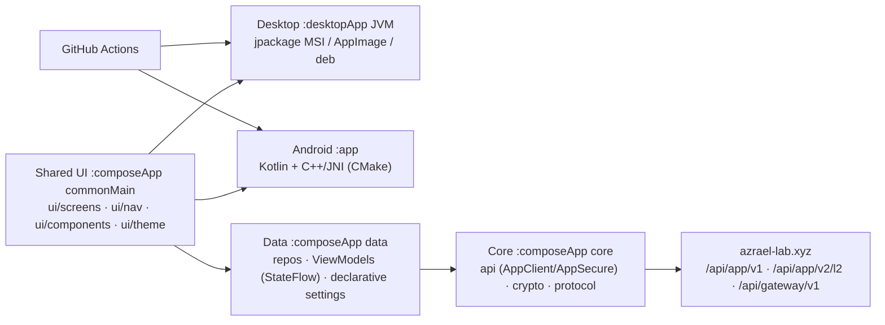
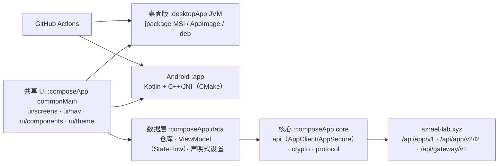

<div align="center">

# 🛰️ AZRAEL-APP

**A cross-platform client for the [azrael-lab.xyz](https://azrael-lab.xyz/) platform** - one shared UI, three platforms.

[](https://github.com/PAF-DE0H1SS/AZRAEL-APP/releases/latest)
[](https://github.com/PAF-DE0H1SS/AZRAEL-APP/releases)
[](https://github.com/PAF-DE0H1SS/AZRAEL-APP/releases)
[](https://github.com/PAF-DE0H1SS/AZRAEL-APP/releases)
[](https://kotlinlang.org)
[](https://www.jetbrains.com/lp/compose-multiplatform/)
[](LICENSE)
[](https://github.com/PAF-DE0H1SS/AZRAEL-APP/actions)

</div>

> [!IMPORTANT]
> **Status: v1.3.3 released (2026-10-01).** The client works against the live platform:
> 63 API operations, E2E-encrypted L2 channel, signed Android APK and desktop
> installers published as GitHub Releases.
> Known limits are listed in the Roadmap section of every language below.

AZRAEL-APP is a cross-platform application built with **Compose Multiplatform** for the
[azrael-lab.xyz](https://azrael-lab.xyz/) project. One shared UI is used by the native Android
build and by the desktop builds: the native layer (C++/JNI) lives in `:app`, the shared client in
`:composeApp`, the desktop wrapper in `:desktopApp`. The app has no offline mode by design - every
screen is backed by the platform API.

---

## Language / Язык / 语言

<details open>
<summary><b>🇬🇧 English</b></summary>

### ✨ Overview

> [!NOTE]
> **Supported platforms** - one codebase, three delivery formats:

| 🖥️ Platform | 📦 Delivery | 🗂️ Format |
|---|---|---|
| 📱 **Android 13+** | APK - signed release (debug build for development) | `.apk` |
| 🖥️ **Windows 10/11** | MSI installer (jpackage) | `.msi` |
| 🐧 **Linux** | Ubuntu / Debian · AppImage · Arch · NixOS | `.deb` · `.AppImage` · `PKGBUILD` · `flake` |

Build coordinates are kept in one place, `gradle.properties`: `azraelVersion=1.3.3`,
`minSdk=33` (Android 13), `targetSdk=36`, `versionCode=6`.

### 🎯 Features

Everything the client can do is an operation of the platform API (`POST /api/app/v1`, 63 ops),
plus the encrypted gateway channel (`/api/app/v2/l2` → `/api/gateway/v1`).

| Area | What works |
|---|---|
| 🔑 Auth | register, login, session verify, logout, revoke other sessions, password change, OTP secret + validation |
| 📱 Devices | bind installation by Ed25519/Fe25519 keys, list, revoke, key rotation, device limit status |
| 👤 Profile | update, avatar set/url, delete, language, privacy settings, account auto-delete |
| 🏠 Home | server-driven `home.boot` tab config |
| 💬 Chats | list (active/archived), create, open, history, send text/file, typing, presence, archive/restore, delete message/chat, per-chat auto-delete |
| 📎 Files | base64 upload, token URL for download |
| 🔗 Shortener | list, create with custom code, delete, QR |
| 📨 Invites | own code, list, generate, archive/unarchive |
| 🛰️ VPN | free-servers summary/list/refresh, WireGuard status, Incys downloads |
| 🤖 AI chats | list, send (FREE-AI coordinator) |
| 🛡️ Admin | freeze list, unfreeze |
| 🔐 Channel | provision key/info/regenerate, gateway handshake, gateway call (L2 E2E) |

### 🧭 Architecture



Module layout inside `:composeApp`:

| Package | Contents |
|---|---|
| `core/api` | `AppClient` (63 ops), `AppSecure` (envelope/signature), `AppKeyBootstrap` (channel key issue), `AppInstall` |
| `core/crypto` | AES-256-GCM (`Crypto`), `Ed25519`, `Fe25519`, `Sha512`, `Base64Codec` |
| `core/protocol` | `Envelope`, `GatewayClient`, `Http` (expect/actual), `SessionBox` |
| `data` | `Repos`, `Models`, `UiState`, ViewModels (`App`, `Chats`, `Settings`, `Vpn`, `Shortener`, `Admin`), `configurable/` settings engine |
| `ui` | `screens/` (9), `nav/` (Navigator, Routes, TabConfig), `components/` (15 design-system components), `theme/` (color, type, shape, spacing, ripple), `StarfieldBackground` |

The C++/JNI native layer stays **Android-only**; desktop builds use a platform-aware fallback, so
the UI is fully shared.

### 🔐 Security model

- **Envelope over HTTPS** (`AppSecure`, v1): request body is sealed with AES-256-GCM under the
  installation key, AAD binds `ts|nonce`, signature is `HMAC-SHA256("V1|ts|nonce|b64(sha256(ct))")`.
- **Anti-replay**: one-shot nonce (server burns it with Redis `SETNX`) and a `ts` window of ±120 s.
- **Mutual authentication**: the site signs the response with the same key, the client verifies it.
- **Channel key never ships in the APK**: on first launch the client fetches a per-installation
  derived key from `GET /api/app/bootstrap?devId=…` (`A_dev = HMAC(APP_V1_KEY, "AZRAEL-APP|dev|v1|<devId>")`),
  so server-side key rotation does not require a new APK release. The user never sees the key.
- **Device binding**: the installation signs requests with keys that stay on the device; bindings can
  be revoked and rotated.
- **L2 gateway**: X25519 (Fe25519) key agreement + AES-256-GCM payloads, session tokens, RBAC
  (`guest` / `standard` / `admin`), versioned protocol. Details: [docs/protocol/azrael-protocol-v1.md](docs/protocol/azrael-protocol-v1.md).
- **Secrets stay out of git**: `signing/`, `local.properties` and `signing/keystore.properties` are
  ignored; nothing in the repo contains a production key.

### 🔨 Build

> [!TIP]
> Use the single script for everything: `./build-all.sh [release|dev|linux]`

<details open>
<summary><b>Android</b></summary>

```bash
./gradlew :app:assembleDebug      # app/build/outputs/apk/debug/app-debug.apk
./gradlew :app:assembleRelease    # R8 minify + resource shrink -> app/build/outputs/apk/release/
```

Release signing is local-only: put `signing/keystore.properties` next to the keystore and the
`release` build type is signed automatically. In CI the keystore does not exist, so the workflow
publishes debug/unsigned APKs as build artifacts only, and the signed production APK is uploaded to
the Release by the owner.
</details>

<details>
<summary><b>Windows MSI</b></summary>

*Run on a Windows host:*

```powershell
.\gradlew.bat :desktopApp:packageMsi
```

Artifact: `desktopApp\build\compose\binaries\main\msi\xyz.azraellab.app-1.3.3.msi`.
</details>

<details>
<summary><b>Linux</b></summary>

```bash
./gradlew :desktopApp:packageAppImage :desktopApp:packageDeb
```

CI additionally repacks the AppImage with `appimagetool` and completes the raw jpackage `.deb`
with `scripts/finish-deb.sh` (correct `Depends`, `.desktop` file, icon, launcher) - the raw jpackage
package is broken on a real Debian machine and is never published.
</details>

<details>
<summary><b>🐧 NixOS</b></summary>

```bash
nix run github:PAF-DE0H1SS/AZRAEL-APP            # from the default branch
nix run github:PAF-DE0H1SS/AZRAEL-APP/v1.3.3     # pinned to a tag
```

Local build (Gradle needs network access) and dev shell:

```bash
nix build . --option sandbox false
nix run .
nix develop
```
</details>

<details>
<summary><b>🐧 Arch</b></summary>

```bash
makepkg -si
```
</details>

### ⬇️ Install

Desktop artifacts and the signed APK are published as GitHub Releases:
[releases/latest](https://github.com/PAF-DE0H1SS/AZRAEL-APP/releases/latest).

| Asset (v1.3.3) | Platform |
|---|---|
| `AZRAEL-1.3.3-release.apk` | Android 13+ (signed production build) |
| `xyz.azraellab.app-1.3.3.msi` | Windows 10/11 |
| `xyz.azraellab.app-1.3.3.AppImage` | Linux x86_64 |
| `xyz.azraellab.app_1.3.3_amd64_azrael.deb` | Ubuntu / Debian |
| `AZRAEL-1.3.3-linux-x86_64.jar` | any JVM 21+ |

Published tags: `v1.0.0`, `v1.2.1`, `v1.3.2` (pre-release), `v1.3.3`. The release carries 5
assets and no checksum file, so verify them yourself: the SHA-256 of the v1.3.3 assets is
recorded in `APP_DEV_LOG/13-app-v1-133-hardening-release-prep.md`. The release job fails the
tag workflow if no production artifact is found.

### 🧪 Tests

183 desktop unit tests cover the crypto/envelope contract, protocol and gateway ops, JSON accessors,
models, UI state, ViewModels, navigation and the WCAG contrast contract of design-system components.

```bash
./gradlew :composeApp:desktopTest --offline --rerun-tasks
```

### ✅ Roadmap

- [x] Shared Compose Multiplatform UI (Android + Desktop)
- [x] Native C++/JNI layer for Android (`minSdk 33`)
- [x] CI auto-build: APK · MSI · AppImage · deb on push and on tag `v*`, Release creation
- [x] Dual licensing (PolyForm NC 1.0.0 + author terms)
- [x] Signed production APK (`signing/` local keystore, R8 + resource shrink)
- [x] Publishable `.deb` with correct dependencies (publishable Linux packaging)
- [x] UI redesign P0-P5: design system, navigation, declarative settings, ViewModel layer, split screens, WCAG contrast contract
- [x] Stable release line `v1.0.0` and later (`v1.2.1`, `v1.3.3`)
- [ ] Manual authenticated smoke test of the full route (login → chat → file → shortener → VPN → admin) - needs a test account or `AZRAEL_FLIGHT_INVITE`
- [ ] Emulator/device smoke tests on Android (AVD S21 Ultra API 36)
- [ ] Real Windows 10/11 hardware test (CI only builds the MSI today)
- [ ] Desktop Compose render tests (need `compose.ui-test` in the Gradle cache)

### 🌿 Branches

| Branch | Purpose |
|---|---|
| `main` | **stable** - released |
| `develop` | integration |
| `feature/*`, `release/*`, `hotfix/*` | as needed |

### 📚 Docs

- [docs/protocol/azrael-protocol-v1.md](docs/protocol/azrael-protocol-v1.md) - L2 gateway protocol, envelope, RBAC, error codes
- [docs/ui-redesign-plan.md](docs/ui-redesign-plan.md) - UI/UX restructure plan and execution journal (P0-P5)
- [docs/APP_DEV_LOG/](docs/APP_DEV_LOG/) - working notes kept in the repository

### 📄 License

Distributed under **hybrid dual licensing** - see [LICENSE](LICENSE):

- **Noncommercial use** → [PolyForm Noncommercial 1.0.0](https://polyformproject.org/licenses/noncommercial/1.0.0) (full text in Part 4)
- **Forks / monetization** → author terms (Parts 1-3): revenue share **≥ 50%**, back-feed clause, CLA

Commercial use requires a written agreement with the author: <typ.onepatop@gmail.com>.

</details>

<details>
<summary><b>🇷🇺 Русский</b></summary>

### ✨ Обзор

> [!NOTE]
> **Поддерживаемые платформы** - одна кодовая база, три формата поставки:

| 🖥️ Платформа | 📦 Поставка | 🗂️ Формат |
|---|---|---|
| 📱 **Android 13+** | APK - подписанный релизный (debug для разработки) | `.apk` |
| 🖥️ **Windows 10/11** | установщик MSI (jpackage) | `.msi` |
| 🐧 **Linux** | Ubuntu / Debian · AppImage · Arch · NixOS | `.deb` · `.AppImage` · `PKGBUILD` · `flake` |

Версия держится в одном месте, `gradle.properties`: `azraelVersion=1.3.3`,
`minSdk=33` (Android 13), `targetSdk=36`, `versionCode=6`.

### 🎯 Возможности

Все функции клиента - это операции API платформы (`POST /api/app/v1`, 63 операции)
плюс зашифрованный канал шлюза (`/api/app/v2/l2` → `/api/gateway/v1`).

| Раздел | Что работает |
|---|---|
| 🔑 Auth | регистрация, вход, проверка сессии, выход, отзыв других сессий, смена пароля, OTP (секрет + валидация) |
| 📱 Устройства | привязка установки по ключам Ed25519/Fe25519, список, отзыв, ротация ключа, статус лимита устройств |
| 👤 Профиль | правка, аватар (set/url), удаление, язык, приватность, автоудаление аккаунта |
| 🏠 Главная | серверный `home.boot` с конфигом вкладок |
| 💬 Чаты | список (активные/архив), создание, открытие, история, отправка текста/файла, «печатает», presence, архив/восстановление, удаление сообщения/чата, автоудаление по чату |
| 📎 Файлы | загрузка base64, ссылка по токену |
| 🔗 Сокращатель | список, создание со своим кодом, удаление, QR |
| 📨 Инвайты | свой код, список, генерация, архив/разархив |
| 🛰️ VPN | сводка/список/обновление бесплатных серверов, статус WireGuard, загрузки Incys |
| 🤖 AI-чаты | список, отправка (координатор FREE-AI) |
| 🛡️ Админка | список замороженных, разморозка |
| 🔐 Канал | provision key/info/regenerate, handshake шлюза, вызовы шлюза (L2 E2E) |

### 🧭 Архитектура


Раскладка внутри `:composeApp`:

| Пакет | Содержимое |
|---|---|
| `core/api` | `AppClient` (63 операции), `AppSecure` (конверт/подпись), `AppKeyBootstrap` (выдача ключа канала), `AppInstall` |
| `core/crypto` | AES-256-GCM (`Crypto`), `Ed25519`, `Fe25519`, `Sha512`, `Base64Codec` |
| `core/protocol` | `Envelope`, `GatewayClient`, `Http` (expect/actual), `SessionBox` |
| `data` | `Repos`, `Models`, `UiState`, ViewModel'ы (`App`, `Chats`, `Settings`, `Vpn`, `Shortener`, `Admin`), движок настроек `configurable/` |
| `ui` | `screens/` (9), `nav/` (Navigator, Routes, TabConfig), `components/` (15 компонентов дизайн-системы), `theme/` (цвет, типографика, формы, отступы, ripple), `StarfieldBackground` |

Нативный слой C++/JNI остаётся **только для Android**; desktop-сборка использует
платформенный fallback - UI полностью общий.

### 🔐 Модель безопасности

- **Конверт поверх HTTPS** (`AppSecure`, v1): тело запроса запечатывается AES-256-GCM ключом
  установки, AAD связывает `ts|nonce`, подпись - `HMAC-SHA256("V1|ts|nonce|b64(sha256(ct))")`.
- **Антиреплей**: одноразовый nonce (сервер гасит его через Redis `SETNX`) и окно `ts` ±120 с.
- **Двусторонняя аутентификация**: сайт подписывает ответ тем же ключом, клиент проверяет подпись.
- **Ключ канала не лежит в APK**: при первом запуске клиент забирает производный для установки
  ключ с `GET /api/app/bootstrap?devId=…` (`A_dev = HMAC(APP_V1_KEY, "AZRAEL-APP|dev|v1|<devId>")`),
  поэтому ротация ключа на сервере не требует нового релиза APK. Пользователь ключ не видит.
- **Привязка устройства**: установка подписывает запросы ключами, которые не покидают устройство;
  привязку можно отозвать и перевыпустить.
- **Шлюз L2**: согласование ключей X25519 (Fe25519) + payloads AES-256-GCM, сессионные токены,
  RBAC (`guest` / `standard` / `admin`), версионируемый протокол. Подробности:
  [docs/protocol/azrael-protocol-v1.md](docs/protocol/azrael-protocol-v1.md).
- **Секреты вне git**: `signing/`, `local.properties` и `signing/keystore.properties` игнорируются;
  продакшн-ключей в репозитории нет.

### 🔨 Сборка

> [!TIP]
> Всё одним скриптом: `./build-all.sh [release|dev|linux]`

<details open>
<summary><b>Android</b></summary>

```bash
./gradlew :app:assembleDebug      # app/build/outputs/apk/debug/app-debug.apk
./gradlew :app:assembleRelease    # R8 + shrink ресурсов -> app/build/outputs/apk/release/
```

Подпись релиза только локальная: положите `signing/keystore.properties` рядом с keystore, и
build type `release` подпишется сам. В CI keystore нет, поэтому workflow отдаёт debug/unsigned
APK только как артефакты сборки, а подписанный production APK владелец загружает в релиз вручную.
</details>

<details>
<summary><b>Windows MSI</b></summary>

*Собирается на Windows-хосте:*

```powershell
.\gradlew.bat :desktopApp:packageMsi
```

Артефакт: `desktopApp\build\compose\binaries\main\msi\xyz.azraellab.app-1.3.3.msi`.
</details>

<details>
<summary><b>Linux</b></summary>

```bash
./gradlew :desktopApp:packageAppImage :desktopApp:packageDeb
```

CI дополнительно перепаковывает AppImage через `appimagetool` и дополняет сырой jpackage `.deb`
скриптом `scripts/finish-deb.sh` (корректный `Depends`, `.desktop`, иконка, лаунчер) - сырой пакет
jpackage на реальной Debian-машине не запускается и не публикуется.
</details>

<details>
<summary><b>🐧 NixOS</b></summary>

```bash
nix run github:PAF-DE0H1SS/AZRAEL-APP            # из ветки по умолчанию
nix run github:PAF-DE0H1SS/AZRAEL-APP/v1.3.3     # зафиксированный тег
```

Локальная сборка (Gradle требует сети) и dev-окружение:

```bash
nix build . --option sandbox false
nix run .
nix develop
```
</details>

<details>
<summary><b>🐧 Arch</b></summary>

```bash
makepkg -si
```
</details>

### ⬇️ Установка

Desktop-артефакты и подписанный APK публикуются как GitHub Releases:
[releases/latest](https://github.com/PAF-DE0H1SS/AZRAEL-APP/releases/latest).

| Ассет (v1.3.3) | Платформа |
|---|---|
| `AZRAEL-1.3.3-release.apk` | Android 13+ (подписанная production-сборка) |
| `xyz.azraellab.app-1.3.3.msi` | Windows 10/11 |
| `xyz.azraellab.app-1.3.3.AppImage` | Linux x86_64 |
| `xyz.azraellab.app_1.3.3_amd64_azrael.deb` | Ubuntu / Debian |
| `AZRAEL-1.3.3-linux-x86_64.jar` | любая JVM 21+ |

Опубликованные теги: `v1.0.0`, `v1.2.1`, `v1.3.2` (pre-release), `v1.3.3`. Релиз содержит
5 ассетов и не содержит файла контрольных сумм, поэтому проверяйте их самостоятельно:
SHA-256 артефактов `v1.3.3` зафиксированы в
`APP_DEV_LOG/13-app-v1-133-hardening-release-prep.md`. Если production-артефактов нет,
tag-workflow падает.

### 🧪 Тесты

183 desktop-теста покрывают контракт криптографии и конверта, protocol/gateway-операции, доступ к
JSON, модели, UI-состояние, ViewModel'ы, навигацию и WCAG-контраст компонентов дизайн-системы.

```bash
./gradlew :composeApp:desktopTest --offline --rerun-tasks
```

### ✅ План развития

- [x] Общий UI на Compose Multiplatform (Android + Desktop)
- [x] Нативный слой C++/JNI для Android (`minSdk 33`)
- [x] CI-автосборка: APK · MSI · AppImage · deb на push и на теге `v*`, создание Release
- [x] Двойное лицензирование (PolyForm NC 1.0.0 + условия автора)
- [x] Подписанный production APK (локальный keystore в `signing/`, R8 + shrink ресурсов)
- [x] Публикуемый `.deb` с корректными зависимостями
- [x] Редизайн UI P0-P5: дизайн-система, навигация, декларативные настройки, слой ViewModel, разбивка экранов, WCAG-контраст
- [x] Стабильная линия релизов `v1.0.0` и далее (`v1.2.1`, `v1.3.3`)
- [ ] Ручной авторизованный смоук полного маршрута (вход → чат → файл → сокращатель → VPN → админка) - нужен тестовый аккаунт или `AZRAEL_FLIGHT_INVITE`
- [ ] Смоук-тесты Android на эмуляторе/устройстве (AVD S21 Ultra API 36)
- [ ] Тест на реальном Windows 10/11 (сейчас CI только собирает MSI)
- [ ] Desktop render-тесты Compose (нужен `compose.ui-test` в кэше Gradle)

### 🌿 Ветки

| Ветка | Назначение |
|---|---|
| `main` | **стабильная** - релизная |
| `develop` | интеграционная |
| `feature/*`, `release/*`, `hotfix/*` | по ситуации |

### 📚 Документы

- [docs/protocol/azrael-protocol-v1.md](docs/protocol/azrael-protocol-v1.md) - протокол шлюза L2, конверт, RBAC, коды ошибок
- [docs/ui-redesign-plan.md](docs/ui-redesign-plan.md) - план редизайна UI/UX и журнал выполнения (P0-P5)
- [docs/APP_DEV_LOG/](docs/APP_DEV_LOG/) - рабочие заметки, которые лежат в репозитории

### 📄 Лицензия

Распространяется по **гибридному двойному лицензированию** - см. [LICENSE](LICENSE):

- **Некоммерческое использование** → [PolyForm Noncommercial 1.0.0](https://polyformproject.org/licenses/noncommercial/1.0.0) (полный текст в Части 4)
- **Форки / монетизация** → условия автора (Части 1-3): revenue share **от 50%**, back-feed clause, CLA

Коммерческое использование требует письменного договора с автором: <typ.onepatop@gmail.com>.

</details>

<details>
<summary><b>🇨🇳 中文</b></summary>

### ✨ 概述

> [!NOTE]
> **支持的平台** - 同一套代码，三种交付格式：

| 🖥️ 平台 | 📦 交付 | 🗂️ 格式 |
|---|---|---|
| 📱 **Android 13+** | APK - 已签名正式版（开发用 debug） | `.apk` |
| 🖥️ **Windows 10/11** | MSI 安装包（jpackage） | `.msi` |
| 🐧 **Linux** | Ubuntu / Debian · AppImage · Arch · NixOS | `.deb` · `.AppImage` · `PKGBUILD` · `flake` |

版本号只在 `gradle.properties` 一处维护：`azraelVersion=1.3.3`、
`minSdk=33`（Android 13）、`targetSdk=36`、`versionCode=6`。

### 🎯 功能

客户端的全部能力都是平台 API 的操作（`POST /api/app/v1`，63 个操作），
外加加密网关通道（`/api/app/v2/l2` → `/api/gateway/v1`）。

| 模块 | 已实现 |
|---|---|
| 🔑 认证 | 注册、登录、会话校验、登出、吊销其他会话、改密码、OTP 密钥与校验 |
| 📱 设备 | 用 Ed25519/Fe25519 密钥绑定安装、列表、吊销、密钥轮换、设备额度状态 |
| 👤 资料 | 修改、头像（set/url）、删除、语言、隐私设置、账号自动删除 |
| 🏠 首页 | 服务端下发 `home.boot` 标签配置 |
| 💬 聊天 | 列表（活跃/归档）、创建、打开、历史、发送文本/文件、正在输入、在线状态、归档/恢复、删除消息/会话、按会话自动删除 |
| 📎 文件 | base64 上传、按令牌取下载地址 |
| 🔗 短链 | 列表、自定义短码创建、删除、二维码 |
| 📨 邀请 | 我的邀请码、列表、生成、归档/取消归档 |
| 🛰️ VPN | 免费节点汇总/列表/刷新、WireGuard 状态、Incys 下载 |
| 🤖 AI 聊天 | 列表、发送（FREE-AI 协调器） |
| 🛡️ 管理 | 冻结列表、解冻 |
| 🔐 通道 | provision key/info/regenerate、网关握手、网关调用（L2 端到端） |

### 🧭 架构



`:composeApp` 内部结构：

| 包 | 内容 |
|---|---|
| `core/api` | `AppClient`（63 个操作）、`AppSecure`（信封/签名）、`AppKeyBootstrap`（通道密钥下发）、`AppInstall` |
| `core/crypto` | AES-256-GCM（`Crypto`）、`Ed25519`、`Fe25519`、`Sha512`、`Base64Codec` |
| `core/protocol` | `Envelope`、`GatewayClient`、`Http`（expect/actual）、`SessionBox` |
| `data` | `Repos`、`Models`、`UiState`、ViewModel（`App`、`Chats`、`Settings`、`Vpn`、`Shortener`、`Admin`）、`configurable/` 设置引擎 |
| `ui` | `screens/`（9）、`nav/`（Navigator、Routes、TabConfig）、`components/`（15 个设计系统组件）、`theme/`（颜色、字体、圆角、间距、ripple）、`StarfieldBackground` |

原生 C++/JNI 层仅用于 **Android**；桌面版使用平台回退，UI 完全共享。

### 🔐 安全模型

- **HTTPS 之上的信封**（`AppSecure`，v1）：请求体用安装密钥做 AES-256-GCM 密封，AAD 绑定
  `ts|nonce`，签名是 `HMAC-SHA256("V1|ts|nonce|b64(sha256(ct))")`。
- **防重放**：一次性 nonce（服务端用 Redis `SETNX` 消费）加 `ts` ±120 秒窗口。
- **双向认证**：网站用同一密钥签名响应，客户端验签。
- **通道密钥不进 APK**：首次启动时客户端从 `GET /api/app/bootstrap?devId=…` 取回按安装派生的
  密钥（`A_dev = HMAC(APP_V1_KEY, "AZRAEL-APP|dev|v1|<devId>")`），因此服务端轮换密钥
  不需要重新发版 APK，用户也看不到密钥。
- **设备绑定**：安装用留在设备上的密钥签名请求，绑定可吊销、可轮换。
- **L2 网关**：X25519（Fe25519）密钥协商 + AES-256-GCM 载荷、会话令牌、RBAC
  （`guest` / `standard` / `admin`）、带版本的协议。详见
  [docs/protocol/azrael-protocol-v1.md](docs/protocol/azrael-protocol-v1.md)。
- **密钥不进 git**：`signing/`、`local.properties`、`signing/keystore.properties` 均被忽略，
  仓库里没有生产密钥。

### 🔨 构建

> [!TIP]
> 一条命令搞定：`./build-all.sh [release|dev|linux]`

<details open>
<summary><b>Android</b></summary>

```bash
./gradlew :app:assembleDebug      # app/build/outputs/apk/debug/app-debug.apk
./gradlew :app:assembleRelease    # R8 混淆 + 资源压缩 -> app/build/outputs/apk/release/
```

正式签名只能本地做：把 `signing/keystore.properties` 放在 keystore 旁边，`release` 构建类型
会自动签名。CI 里没有 keystore，所以 workflow 只把 debug/unsigned APK 当构建产物发布，
已签名的 production APK 由作者手动上传到 Release。
</details>

<details>
<summary><b>Windows MSI</b></summary>

*请在 Windows 主机上构建：*

```powershell
.\gradlew.bat :desktopApp:packageMsi
```

产物：`desktopApp\build\compose\binaries\main\msi\xyz.azraellab.app-1.3.3.msi`。
</details>

<details>
<summary><b>Linux</b></summary>

```bash
./gradlew :desktopApp:packageAppImage :desktopApp:packageDeb
```

CI 会用 `appimagetool` 重打 AppImage，并用 `scripts/finish-deb.sh` 补全 jpackage 生成的
`.deb`（正确的 `Depends`、`.desktop`、图标、启动器）- 原始 jpackage 包在真实 Debian 机器上
无法运行，也不会发布。
</details>

<details>
<summary><b>🐧 NixOS</b></summary>

```bash
nix run github:PAF-DE0H1SS/AZRAEL-APP            # 默认分支
nix run github:PAF-DE0H1SS/AZRAEL-APP/v1.3.3     # 锁定 tag
```

本地构建（Gradle 需要网络）与开发环境：

```bash
nix build . --option sandbox false
nix run .
nix develop
```
</details>

<details>
<summary><b>🐧 Arch</b></summary>

```bash
makepkg -si
```
</details>

### ⬇️ 安装

桌面产物与已签名 APK 以 GitHub Releases 发布：
[releases/latest](https://github.com/PAF-DE0H1SS/AZRAEL-APP/releases/latest)。

| 附件（v1.3.3） | 平台 |
|---|---|
| `AZRAEL-1.3.3-release.apk` | Android 13+（已签名 production 包） |
| `xyz.azraellab.app-1.3.3.msi` | Windows 10/11 |
| `xyz.azraellab.app-1.3.3.AppImage` | Linux x86_64 |
| `xyz.azraellab.app_1.3.3_amd64_azrael.deb` | Ubuntu / Debian |
| `AZRAEL-1.3.3-linux-x86_64.jar` | 任意 JVM 21+ |

已发布 tag：`v1.0.0`、`v1.2.1`、`v1.3.2`（预发布）、`v1.3.3`。该 release 含 5 个附件，
不含校验和文件，因此请自行校验：`v1.3.3` 各附件的 SHA-256 记录在
`APP_DEV_LOG/13-app-v1-133-hardening-release-prep.md`。
若找不到 production 产物，tag 工作流会直接失败。

### 🧪 测试

183 个桌面单元测试覆盖加密/信封契约、协议与网关操作、JSON 访问器、模型、UI 状态、
ViewModel、导航，以及设计系统组件的 WCAG 对比度契约。

```bash
./gradlew :composeApp:desktopTest --offline --rerun-tasks
```

### ✅ 路线图

- [x] Compose Multiplatform 共享 UI（Android + 桌面）
- [x] Android 原生 C++/JNI 层（`minSdk 33`）
- [x] CI 自动构建：push 与 `v*` tag → APK · MSI · AppImage · deb，并创建 Release
- [x] 双重许可（PolyForm NC 1.0.0 + 作者条款）
- [x] 已签名 production APK（`signing/` 本地 keystore，R8 + 资源压缩）
- [x] 依赖正确的可发布 `.deb`
- [x] UI 重设计 P0-P5：设计系统、导航、声明式设置、ViewModel 层、拆分屏幕、WCAG 对比度契约
- [x] 稳定版本线 `v1.0.0` 及之后（`v1.2.1`、`v1.3.3`）
- [ ] 完整链路的授权手工冒烟（登录 → 聊天 → 文件 → 短链 → VPN → 管理）- 需要测试账号或 `AZRAEL_FLIGHT_INVITE`
- [ ] Android 模拟器/真机冒烟测试（AVD S21 Ultra API 36）
- [ ] 真实 Windows 10/11 硬件测试（目前 CI 只构建 MSI）
- [ ] 桌面 Compose 渲染测试（Gradle 缓存需要 `compose.ui-test`）

### 🌿 分支

| 分支 | 用途 |
|---|---|
| `main` | **稳定版** - 已发布 |
| `develop` | 集成分支 |
| `feature/*`、`release/*`、`hotfix/*` | 按需使用 |

### 📚 文档

- [docs/protocol/azrael-protocol-v1.md](docs/protocol/azrael-protocol-v1.md) - L2 网关协议、信封、RBAC、错误码
- [docs/ui-redesign-plan.md](docs/ui-redesign-plan.md) - UI/UX 重构方案与执行日志（P0-P5）
- [docs/APP_DEV_LOG/](docs/APP_DEV_LOG/) - 随仓库保存的工作笔记

### 📄 许可证

采用**混合双重许可**发布 - 见 [LICENSE](LICENSE)：

- **非商业用途** → [PolyForm Noncommercial 1.0.0](https://polyformproject.org/licenses/noncommercial/1.0.0)（完整文本见第 4 部分）
- **分支 / 商业变现** → 作者条款（第 1-3 部分）：收益分成不低于 **50%**、回馈条款（Back-feed）、CLA

商业使用需与作者签订书面协议：<typ.onepatop@gmail.com>。

</details>

---

<div align="center">

**AZRAEL-APP** · client for [azrael-lab.xyz](https://azrael-lab.xyz/) · [Actions](https://github.com/PAF-DE0H1SS/AZRAEL-APP/actions) · [Releases](https://github.com/PAF-DE0H1SS/AZRAEL-APP/releases) · [LICENSE](LICENSE)

</div>
